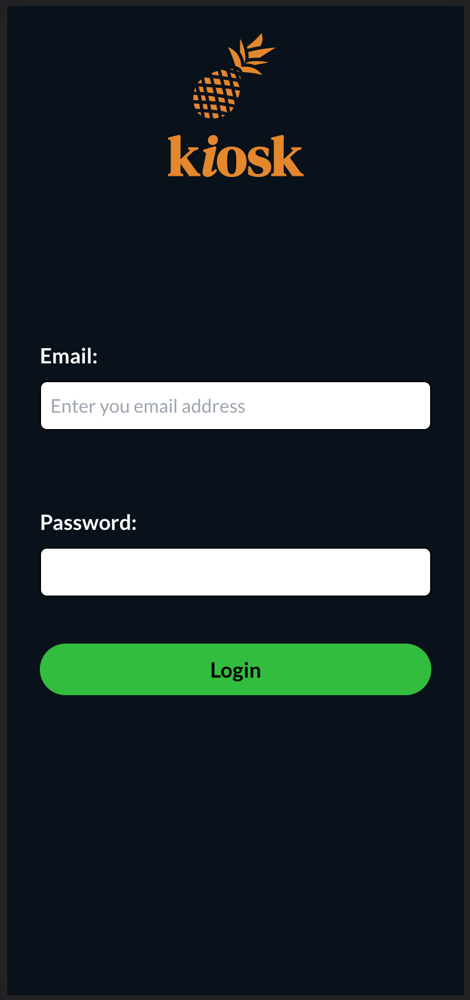
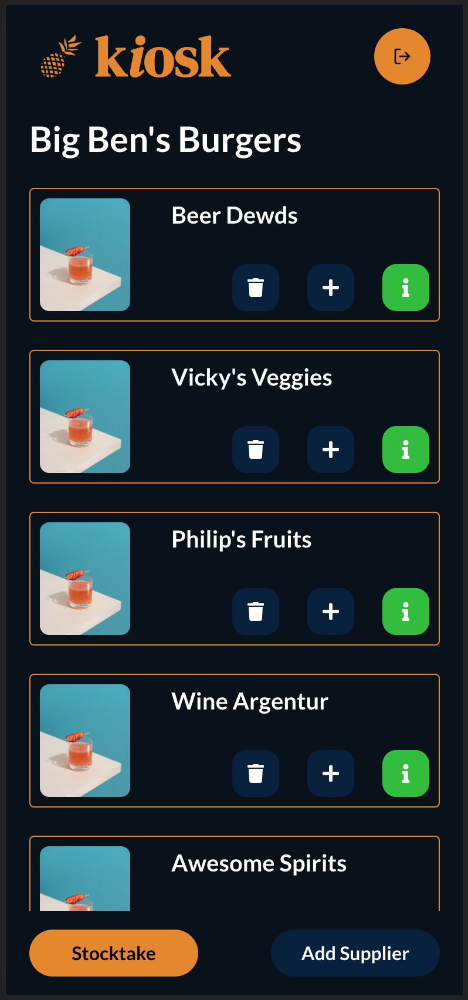
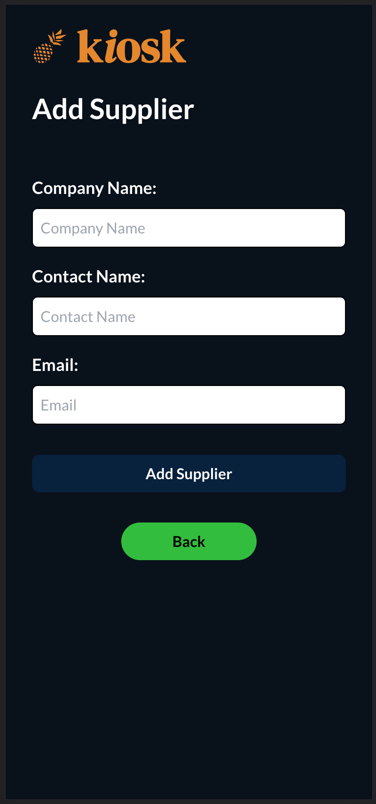
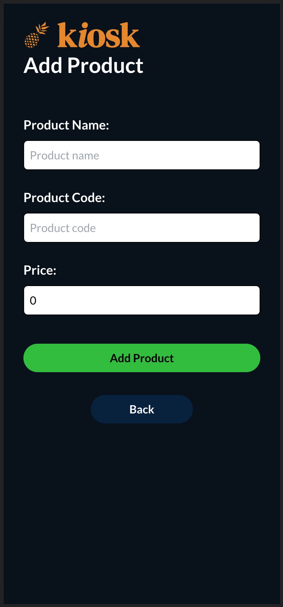
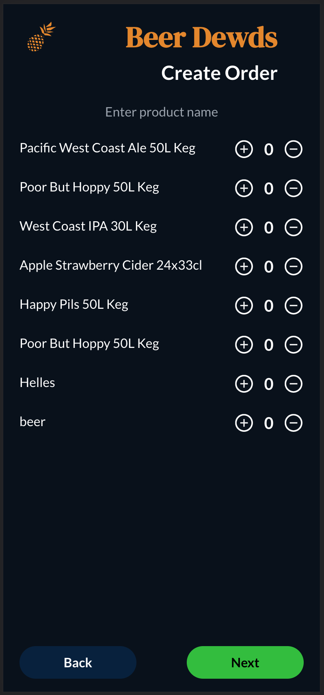
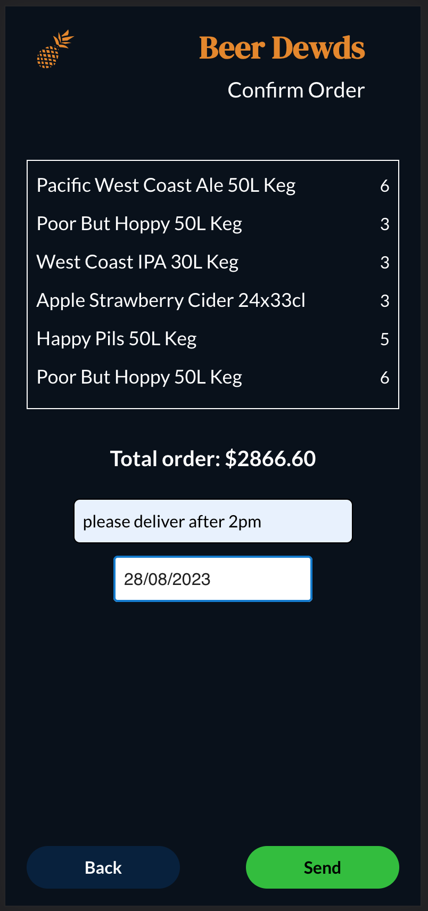
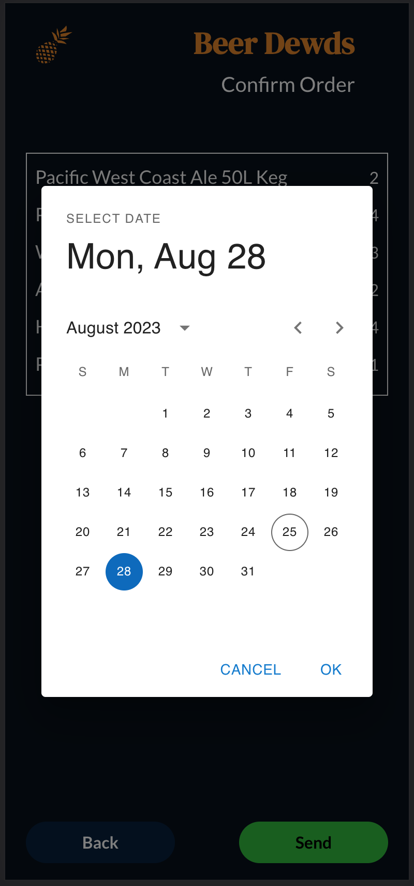

# kiosk-inventory-management

Introducing **kiosk**: The Mobile-Friendly Inventory Management App for Restaurants and Bars

Are you tired of managing multiple systems and dealing with the hassle of ordering supplies for your restaurant or bar? Look no further than **kiosk**, the comprehensive inventory management app designed to streamline your ordering process and make it a breeze.

With **kiosk**, you can say goodbye to the complexities of manual order placement. Our app consolidates all your ordering needs into one convenient platform, saving you time and effort. Whether you need to restock ingredients, beverages, or other supplies, **kiosk** has got you covered.

Ordering with suppliers has never been easier. With just a few clicks, you can create and customize your orders directly within the app. **kiosk** allows you to select your desired products from your list of suppliers and add or remove items with ease. Once your order is complete, the app automatically generates a structured order summary for you.

But that's not all. kiosk takes your convenience a step further by seamlessly communicating with your suppliers. When you finalize your order, the app automatically sends an email to your chosen supplier, ensuring they receive all the necessary information. You can include additional comments or special instructions for your supplier, ensuring accurate and personalized service every time.

Say goodbye to the complexities of inventory management and embrace the simplicity of **kiosk**. A demo of the app can be found [here](https://youtu.be/sVBb7eZE4bQ)↗ and discover a world of effortless ordering for your restaurant or bar. Experience the power of streamlined inventory management with **kiosk** today!

   
   
   
   
   
   
   

## Tech Stack

### Frontend:
- React
- TypeScript
- Tailwind CSS

### Backend
- Node.js
- PostgreSQL
- Prisma

## Installation

### Requirements

You will need to have **postgres** installed on your computer to run the database.

### Setting up the local environment

1. Run `npm install` in the client and server folders to add the required dependencies.

2. Run `npm install prisma --save-dev` to get Prisma installed globally on your machine.

3. In the server folder, run `npm run create-db` from the terminal to create a database.

4. Create an .env file in the server folder with the following variables and populate with your local values:

- `PORT=8080`
- `POSTGRES_USER=`
- `POSTGRES_PWD=`
- `POSTGRES_DB=kiosk`
- `DB_HOST=localhost`
- `DB_PORT=`
- `DATABASE_URL="postgresql://${POSTGRES_USER}:${POSTGRES_PWD}@${DB_HOST}:${DB_PORT}/${POSTGRES_DB}"`

5. Run `npx prisma migrate dev` to set up the database and create the necessary tables.

6. Initiate the app, in the terminal run `npm run start` from the client folder and `nodemon index.js` or `node index.js`.
   The app was designed for mobile view so the browser will have to be resized to mobile dimensions. This can be done in the chrome development tools.

## Bugs & Fixes

### Frontend

- Seperate Components and Pages: each file in the Pages folder corresponds to a single page and their only job is to render components (no logic in these 'components') and your Components folder contains the actual components and the logic inside of them.
- create Assets for logo, app name, labels etc to avoid repetition.
- Create .env file for API_URL.
- Authentication
- Functionality to update products and suppliers
- State to hold current order. Problem when navigating back from "confirm order page", order disappears

### Backend
- Authentication
- Functionality to update products and suppliers
- Convert backend to typescript to be consistent with frontend.
- Add model in database to store Stocktakes. An api will need to be set up to provide this functionality in the front end.

## Improvements

- A stocktake report to be created that could be exported to CSV or excel for easier analysis.
- A web version that allows the user a more comfortable experience to create, add, delete, update the products and suppliers.
- Display a dashboard of past orders, past stocktakes, order totals tracking and stocktake totals tracking.
